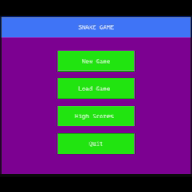
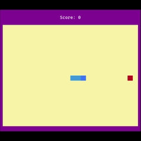
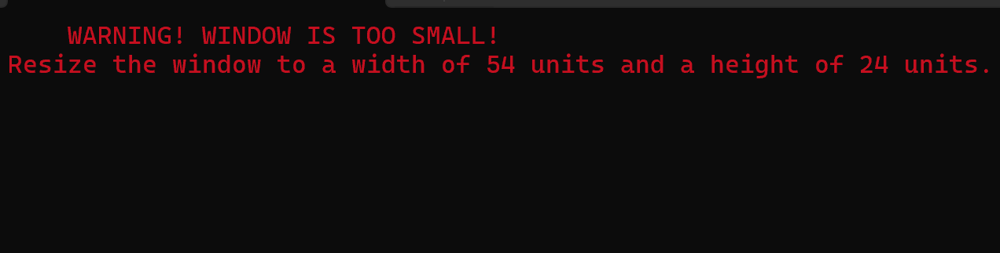

<h1 align="center" style="color:#78C3FF;">🐍 Console Snake Game</h1>

This is a feature-rich implementation of the classic Snake Game with a <span style="color:#FF00FF;">**Text-based User Interface (TUI)**</span> written in <span style="color:#AFB3ED;">**C++**</span>.

<center>
<div style="max-width:400px;">


</div>
</center>

## 📑 Table of Contents
- [<span style="color:#00FF00;">About</span>](#-about)
- [<span style="color:#FFD700;">Features</span>](#-features)
- [<span style="color:#00FFFF;">Tech Stack and Requirements</span>](#️-tech-stack-and-requirements)
- [<span style="color:#FF00FF;">Installation Steps</span>](#️-installation-steps)
- [<span style="color:#FFA500;">Controls</span>](#-controls)
- [<span style="color:#ADFF2F;">Project Architecture</span>](#️-project-architecture)
- [<span style="color:#F58727;">Known Issues and Limitations</span>](#️-known-issues-and-limitations)

## 📖 <span style="color:#00FF00;">About</span>
* This project is a modern C++ take on the classic game.
* Unlike other standard console applications that use simple output loops, this project utilizes the Windows API to manage colors and screen refreshing.
* This was designed to demonstrate:
    * Object-Oriented Programming principles,
    * File handling,
    * and the use of algorithm to handle and display grid-based movement.

## ✨ <span style="color:#FFD700;">Features</span>

📂 **Permanent Save System:** Save your progress and resume later. The game reads from and writes to `.txt` files that hold records with data separated by commas.

🕹️ **3 Difficulty Levels:** Easy, Medium and Hard.

💯 **HighScore Tracking:** Automatically tracks and sorts the top score for each difficulty level.

💻 **Responsive TUI:** *Text-based User Interface (TUI)* that uses dynamic coloring for the UI elements.


## 🛠️ <span style="color:#00FFFF;">Tech Stack and Requirements</span>


||||
|:---:|:---:|:---:|
|**Language Used**|[](https://skillicons.dev)|C++ (**Recommended:** C++17 and up) |
|**Platform Used**|[](https://skillicons.dev)|Visual Studio Community 2022/26 |
|**Compatible OS**|[](https://skillicons.dev)|Windows 10/11 |
||||

><span style="color:red;">⚠️ **WARNING**: This game can only be run on **Windows** operating systems due to the usage of OS-specific libraries such as *'Windows.h'* and *'Conio.h'*.</span>

## ⚙️ <span style="color:#FF00FF;">Installation Steps</span>
1. **Clone the Repository**

    ```bash
    git clone https://github.com/SenukaWijerathna/SnakeGame.git
    ```


2. **Compile**
* **Visual Studio (Recommended):** Open the `.sln` file (if available) or create a new Console Project and import all `.h` and `.cpp` files.

* **MSVC (Using the Developer Command Prompt for VS)**
    ```bash
    cl /EHsc /std:c++17 src\*.cpp /I include /Fe:SnakeGame.exe && del *.obj
    ```
    C++ version can be changed, however minimum C++11 is required due to the usage of ```std::thread``` and ```std::chrono``` etc.
    
    *C++17 is recommended.*

* **G++ (MinGW):**

    ```bash
    g++ src/*.cpp -I include -o SnakeGame.exe -static
    ```


3. **Run**

    Launch the `SnakeGame.exe` file.


## 🎮 <span style="color:#FFA500;">Controls</span>
|Action|Key(s)|
|:--|:--|
|||
|<span style="color:#DD86F7;">In the Game Menus:</span>||
|**Navigate Up**|`Arrow Up (↑)` or `Arrow Left (←)`|
|**Navigate Down**|`Arrow Down (↓)` or `Arrow Right (→)`|
|**Select Option**|`Enter`|
|**Return to Main Menu/Cancel Operation**|`Esc`|
|||
|||
|<span style="color:#FFFFC5;">Keys used during the gameplay:</span>||
|**Move Up**|`Arrow Up (↑)` or `W`|
|**Move Down**|`Arrow Down (↓)` or `S`|
|**Move Left**|`Arrow Left (←)` or `A`|
|**Move Right**|`Arrow Right (→)` or `D`|
|**Pause Game**|`Spacebar` or `Esc`|
|**Select (Menus)**|`Enter`|
|**Navigate (Menus)**|`Arrow Keys`|
|||

## 🏗️ <span style="color:#ADFF2F;">Project Architecture</span>
The project is structured using strict OOP principles
* **Game Loop & Rendering:** The game uses `refreshScreen()` function to refresh the screen and check the console window size, and the gameplay grid is rendered by a 2D deque that contains Pixel objects, where each `Pixel` determines its color based on its nature (snake's head, body, fruit,or a blank area).

* **Snake Logic:** The snake is represented as a `std::deque<std::pair<int,int>>` which contains the coordinates of each snake segment. 

* **File I/O:**
    * `savedGames.txt`: Stores the game records in the form of:
        `name,difficulty,score,direction,snake-coordinates,fruit-coordinates`
    
    * **highScores.txt**: Stores high scores in the form of:
        `difficulty,name,score`
    
    * Data is parsed using `stringstream` to convert raw text back into `GameRecord` objects.


## ⚠️ <span style="color:#F58727;">Known Issues and Limitations</span>
1. **Window Resizing:** Having a width or height lower than the minimum window size (`VISUAL_WIDTH` and `VISUAL_HEIGHT`) causes the GUI to glitch. As a preventive measure, `windowSizeCheck` function was added to temporarily stop the gameplay.

    Therefore, if you see a message like this:

    


    Simply resize the console window according to the given width and height requirements and continue.
To prevent accidental snake collisions after resizing the window, the game is set to pause so the player has time to return to the control keys. 


2. **Input:** Rapid inputs might occasionally buffer due to the `_kbhit()` implementation speed relative to the frame refresh rate.

---
*Created by [Senuka Wijerathna](https://github.com/SenukaWijerathna)*
